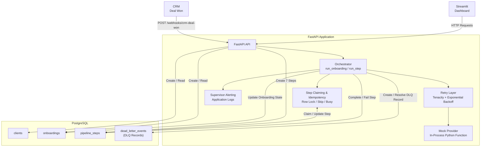
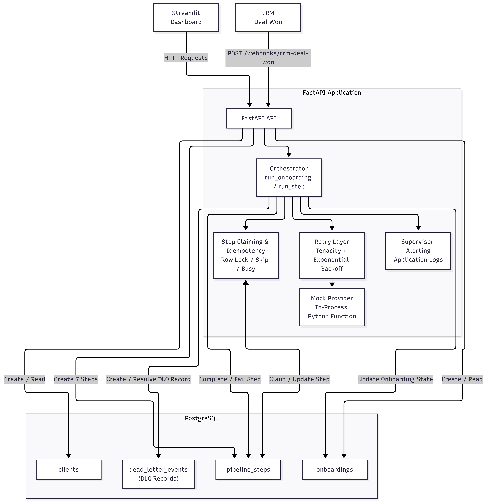

# Architecture Diagram

This diagram shows the main components of the Client Onboarding Pipeline and how they are connected.

```mermaid
flowchart TB

    CRM["CRM<br/>Deal Won"]
    DASH["Streamlit<br/>Dashboard"]

    subgraph APP["FastAPI Application"]
        API["FastAPI API"]
        ORCH["Orchestrator<br/>run_onboarding / run_step"]
        IDEM["Step Claiming & Idempotency<br/>Row Lock / Skip / Busy"]
        RETRY["Retry Layer<br/>Tenacity + Exponential Backoff"]
        MOCK["Mock Provider<br/>In-Process Python Function"]
        ALERT["Supervisor Alerting<br/>Application Logs"]

        API --> ORCH
        ORCH --> IDEM
        ORCH --> RETRY
        RETRY --> MOCK
        ORCH --> ALERT
    end

    subgraph DB["PostgreSQL"]
        CLIENTS["clients"]
        ONBOARDINGS["onboardings"]
        STEPS["pipeline_steps"]
        DLQ["dead_letter_events<br/>(DLQ Records)"]
    end

    CRM -->|"POST /webhooks/crm-deal-won"| API
    DASH -->|"HTTP Requests"| API

    API -->|"Create / Read"| CLIENTS
    API -->|"Create / Read"| ONBOARDINGS
    API -->|"Create 7 Steps"| STEPS

    IDEM <-->|"Claim / Update Step"| STEPS
    ORCH -->|"Update Onboarding State"| ONBOARDINGS
    ORCH -->|"Complete / Fail Step"| STEPS
    ORCH -->|"Create / Resolve DLQ Record"| DLQ
```

## Exported Diagram

